# 数据库设计文档（knowflow 知识库）

本文档说明知识库学习平台的数据库表结构（共 **43 张表**）、字段定义、表间关系（逻辑外键）与索引设计。
脚本位置：`backend/src/main/resources/schema.sql`（表结构 + 索引）、`data.sql`（种子数据）。

> **IM（学习小组 / 单聊私信）相关表**（`study_group*`、`private_*`）以 **`消息功能技术方案.md`** 为唯一权威文档，
> 本文仅列出其结构概要，字段/协议以该文档为准。

> **设计规范**：遵循《阿里巴巴 Java 开发手册》——【强制】不得使用物理外键与级联，
> 一切外键概念必须在应用层（Service）解决。本库所有表间关联均为「逻辑外键」，
> 仅存关联列 + 建普通索引，关系完整性由业务代码保证。

> 开发环境使用 H2 内存库（`jdbc:h2:mem:knowflow;MODE=MySQL`），生产可平滑切换为 MySQL（DDL 语法已兼容）。

---

## 一、实体关系（ER）总览

```mermaid
erDiagram
    sys_user ||--o{ doc_favorite : "收藏"
    sys_user ||--o{ doc_read_progress : "阅读进度"
    sys_user ||--o{ chat_conversation : "对话"
    sys_user ||--o{ chat_message : "消息"
    sys_user ||--o{ learning_user_path : "学习进度"
    sys_user ||--o{ learning_task : "学习任务"
    doc_category ||--o{ doc_document : "归属分类"
    doc_category ||--o{ doc_category : "父子(自引用, parent_id 哨兵0)"
    doc_document ||--o{ doc_favorite : "被收藏"
    doc_document ||--o{ doc_read_progress : "被阅读"
    chat_conversation ||--o{ chat_message : "包含消息"
    learning_path ||--o{ learning_chapter : "包含章节"
    learning_path ||--o{ learning_user_path : "用户报名"
    learning_path ||--o{ learning_flashcard : "关联闪卡"
    learning_chapter ||--o{ learning_flashcard : "关联闪卡"
    sys_user ||--o{ learning_user_chapter : "章节完成记录"
    sys_user ||--o{ learning_mistake : "错题"
    sys_user ||--o{ community_post : "发帖"
    sys_user ||--o{ community_comment : "评论"
    sys_user ||--o{ community_post_like : "点赞"
    community_post ||--o{ community_comment : "包含评论"
    community_post ||--o{ community_post_like : "被点赞"
    sys_user ||--o{ sys_notification : "接收通知"
    sys_user ||--|| sys_user_ai_config : "AI配置"
    sys_user ||--o{ sys_icon : "自定义图标"
    doc_category ||--o{ kb_member : "知识库成员"
    sys_user ||--o{ kb_member : "加入知识库"
    doc_category ||--o{ quiz_question : "题库归属"
    doc_document ||--o{ quiz_question : "题目关联文档"
    quiz_question ||--o{ quiz_answer_record : "答题记录"
    sys_user ||--o{ quiz_answer_record : "作答"
    sys_user ||--o{ user_check_in : "每日打卡"
    sys_user ||--o{ learning_path : "采用私有路径(owner_user_id)"
    sys_user ||--o{ ai_personalized_path : "个性化路径缓存"
    ai_personalized_path |o--o| learning_path : "采用落地(related_path_id)"
    sys_user ||--o{ ai_concept_diagram : "概念图解缓存"
    sys_user ||--o{ study_group : "创建小组"
    study_group ||--o{ study_group_member : "小组成员"
    study_group ||--o{ study_group_message : "小组消息"
    sys_user ||--o{ private_conversation : "私聊会话"
    private_conversation ||--o{ private_message : "私聊消息"
    doc_document ||--o{ doc_chunk : "分块向量(RAG)"
    code_challenge ||--o{ code_challenge_level : "关卡"
    sys_user ||--o{ code_challenge_record : "挑战进度"
    code_challenge ||--o{ code_challenge_record : "进度"
    sys_user ||--o{ user_achievement : "成就解锁"
    achievement ||--o{ user_achievement : "解锁记录"
    sys_user ||--o{ code_submit_record : "代码提交"
    kg_entity ||--o{ kg_relation : "关系源/目标"
    doc_category ||--o{ kg_entity : "实体所属分类"
    doc_document ||--o{ kg_entity : "实体抽取来源"
```

### 表间关系表（逻辑外键，非物理约束）

下表描述业务上的关联语义，**数据库不建立任何 FOREIGN KEY 约束**，关联列均建有普通索引以保证 JOIN/查询性能，完整性由 Service 层保证。

| 子表 | 关联列 | 逻辑引用 | 关联索引 | 可空 |
|---|---|---|---|---|
| doc_document | category_id | doc_category(id) | idx_doc_category | 是 |
| doc_favorite | user_id | sys_user(id) | idx_fav_user | 否 |
| doc_favorite | doc_id | doc_document(id) | idx_fav_doc | 否 |
| doc_read_progress | user_id | sys_user(id) | idx_rp_user | 否 |
| doc_read_progress | doc_id | doc_document(id) | idx_rp_doc | 否 |
| chat_conversation | user_id | sys_user(id) | idx_conv_user | 否 |
| chat_message | conversation_id | chat_conversation(id) | idx_msg_conv | 否 |
| chat_message | user_id | sys_user(id) | （随查询） | 否 |
| learning_chapter | path_id | learning_path(id) | idx_chap_path | 否 |
| learning_user_path | user_id | sys_user(id) | idx_up_user | 否 |
| learning_user_path | path_id | learning_path(id) | idx_up_path | 否 |
| learning_flashcard | path_id | learning_path(id) | idx_fc_path | 是 |
| learning_flashcard | chapter_id | learning_chapter(id) | idx_fc_chap | 是 |
| learning_task | user_id | sys_user(id) | idx_task_user | 否 |
| learning_user_chapter | user_id / path_id / chapter_id | sys_user / learning_path / learning_chapter | idx_uc_user_chapter 等 + uk(user_id,chapter_id) | 否 |
| learning_mistake | user_id | sys_user(id) | idx_mistake_user | 否 |
| community_post | user_id | sys_user(id) | idx_post_user | 否 |
| community_post_like | post_id / user_id | community_post / sys_user | uk_post_like(post_id,user_id) | 否 |
| community_comment | post_id / user_id | community_post / sys_user | idx_comment_post / idx_comment_user | 否 |
| sys_notification | user_id | sys_user(id) | idx_notif_user | 否 |
| sys_user_ai_config | user_id | sys_user(id) | uk_user_ai_config_user(user_id,deleted) | 否 |
| sys_icon | user_id | sys_user(id) | idx_icon_user | 是 |
| doc_category | owner_id | sys_user(id) | idx_cat_owner | 是 |
| kb_member | category_id / user_id | doc_category / sys_user | uk_kb_member_cat_user + idx 若干 | user_id 可空（邮箱邀请） |
| quiz_question | category_id / doc_id | doc_category / doc_document | idx_qq_category / idx_qq_doc | 是 |
| quiz_answer_record | user_id / question_id | sys_user / quiz_question | idx_qar_user / idx_qar_question | 否 |
| user_check_in | user_id | sys_user(id) | idx_uci_user + uk(user_id,check_date) | 否 |
| learning_path | owner_user_id | sys_user(id)；0=平台公开路径 | idx_lp_owner | 否（默认 0） |
| ai_personalized_path | user_id / related_path_id | sys_user / learning_path | idx_app_user + uk(user_id,goal,level,daily_minutes,deleted) | related_path_id 可空 |
| ai_concept_diagram | user_id | sys_user(id) | idx_acd_user + uk(user_id,concept,deleted) | 否 |
| study_group | owner_id | sys_user(id) | idx_sg_owner | 否 |
| study_group_member | group_id / user_id | study_group / sys_user | idx_sgm_user + uk(group_id,user_id,deleted) | 否 |
| study_group_message | group_id / sender_id | study_group / sys_user | idx_sgm_group / idx_sgm_sender | 否 |
| private_conversation | user_a_id / user_b_id | sys_user(id) | idx_pc_user_a/_b + uk(user_a_id,user_b_id,deleted) | 否 |
| private_conversation_read | conversation_id / user_id | private_conversation / sys_user | idx_pcr_user + uk(conversation_id,user_id,deleted) | 否 |
| private_message | conversation_id / sender_id | private_conversation / sys_user | idx_pm_conv / idx_pm_sender | 否 |
| doc_chunk | doc_id | doc_document(id) | idx_dc_doc | 否 |
| code_challenge_level | challenge_id | code_challenge(id) | idx_ccl_challenge | 否 |
| code_challenge_record | user_id / challenge_id | sys_user / code_challenge | idx_ccr_user / idx_ccr_user_ch | 否 |
| user_achievement | user_id / achievement_id | sys_user / achievement | idx_ua_user + uk(user_id,achievement_id) | 否 |
| code_challenge_level_record | user_id / challenge_id / level_id | sys_user / code_challenge / code_challenge_level | idx_cclr_user / idx_cclr_user_lvl | 否 |
| code_submit_record | user_id / question_id | sys_user / code_question | idx_csr_user / idx_csr_question | 否 |
| kg_entity | doc_id / category_id | doc_document / doc_category | idx_kg_entity_doc / idx_kg_entity_category + idx_kg_entity_name | doc_id 否 / category_id 可空 |
| kg_relation | source_entity_id / target_entity_id / doc_id | kg_entity / kg_entity / doc_document | idx_kg_rel_source / idx_kg_rel_target / idx_kg_rel_doc | 否 |

> 说明：`doc_category.parent_id` 用 `0` 表示顶级分类（哨兵值）；所有逻辑删除列 `deleted` 不参与关联。以上均为逻辑外键，物理层无 FOREIGN KEY 约束。

---

## 二、数据表详细设计

### 1. sys_user（用户表）
| 字段 | 类型 | 说明 | 约束 |
|---|---|---|---|
| id | BIGINT | 主键，自增 | PK |
| username | VARCHAR(50) | 用户名 | 唯一、非空 |
| email | VARCHAR(100) | 邮箱 | |
| password | VARCHAR(255) | 密码（BCrypt 加密） | 非空 |
| nickname | VARCHAR(50) | 昵称 | |
| avatar | VARCHAR(255) | 头像 URL | |
| role | VARCHAR(20) | 角色 USER/ADMIN | 默认 USER |
| total_study_hours | DECIMAL(10,2) | 累计学习时长 | 默认 0 |
| read_docs_count | INT | 已读文档数 | 默认 0 |
| streak_days | INT | 连续打卡天数 | 默认 0 |
| favorite_count | INT | 收藏数 | 默认 0 |
| level | INT | 等级 | 默认 1 |
| exp | INT | 经验值 | 默认 0 |
| energy | INT | 能量值 | 默认 100 |
| provider | VARCHAR(20) | OAuth 提供方（github/wechat） | 可空 |
| provider_uid | VARCHAR(100) | OAuth 第三方唯一 ID | 可空 |
| create_time / update_time | TIMESTAMP | 创建/更新时间 | |
| deleted | INT | 逻辑删除（0/1） | 默认 0 |
- 索引：`idx_user_role(role)`、`idx_user_deleted(deleted)`、`uk_user_email(email)` 唯一

### 2. doc_document（文档表）
| 字段 | 类型 | 说明 | 约束 |
|---|---|---|---|
| id | BIGINT | 主键 | PK |
| title | VARCHAR(200) | 标题 | 非空 |
| content | TEXT | 正文 | |
| summary | VARCHAR(500) | 摘要 | |
| cover | VARCHAR(255) | 封面 | |
| icon | VARCHAR(255) | 图标名（lucide 图标） | |
| file_name | VARCHAR(500) | 原始文件名（上传时保留，含扩展名） | |
| file_url | VARCHAR(500) | 原始文件访问路径（/uploads/...），用于原文下载/预览 | |
| file_size | BIGINT | 原始文件字节大小 | |
| category_id | BIGINT | 分类 ID | 逻辑关联 → doc_category |
| category_path | VARCHAR(500) | 分类路径 | |
| tags | VARCHAR(500) | 标签（逗号分隔） | |
| view_count | INT | 浏览数 | 默认 0 |
| read_count | INT | 阅读数 | 默认 0 |
| favorite_count | INT | 收藏数 | 默认 0 |
| word_count | INT | 字数 | 默认 0 |
| difficulty | INT | 难度（1-3） | 默认 1 |
| sort_order | INT | 排序 | 默认 0 |
| status | INT | 状态（1 已发布） | 默认 1 |
| create_time / update_time | TIMESTAMP | | |
| deleted | INT | 逻辑删除 | 默认 0 |
- 索引：`idx_doc_category(category_id)`、`idx_doc_status(status)`、`idx_doc_deleted(deleted)`、`idx_doc_ctime(create_time)`

### 3. doc_category（分类表）
| 字段 | 类型 | 说明 | 约束 |
|---|---|---|---|
| id | BIGINT | 主键 | PK |
| name | VARCHAR(50) | 名称 | 非空 |
| code | VARCHAR(50) | 编码 | |
| parent_id | BIGINT | 父分类（0=顶级） | 哨兵 0，无约束 |
| icon | VARCHAR(255) | 图标 | |
| description | VARCHAR(500) | 描述 | |
| sort_order | INT | 排序 | 默认 0 |
| doc_count | INT | 文档数 | 默认 0 |
| status | INT | 状态 | 默认 1 |
| owner_id | BIGINT | 知识库所有者 | 逻辑关联 → sys_user（可空） |
| create_time / update_time | TIMESTAMP | | |
| deleted | INT | 逻辑删除 | 默认 0 |
- 索引：`idx_cat_parent(parent_id)`、`idx_cat_status(status)`、`idx_cat_owner(owner_id)`

### 4. doc_favorite（收藏表）
| 字段 | 类型 | 说明 | 约束 |
|---|---|---|---|
| id | BIGINT | 主键 | PK |
| user_id | BIGINT | 用户 | 逻辑关联 → sys_user |
| doc_id | BIGINT | 文档 | 逻辑关联 → doc_document |
| create_time / update_time | TIMESTAMP | | |
| deleted | INT | 逻辑删除 | 默认 0 |
- 索引：`idx_fav_user(user_id)`、`idx_fav_doc(doc_id)`；联合唯一 `uk_fav_user_doc(user_id, doc_id)` 防并发重复收藏

### 5. doc_read_progress（阅读进度表）
| 字段 | 类型 | 说明 | 约束 |
|---|---|---|---|
| id | BIGINT | 主键 | PK |
| user_id | BIGINT | 用户 | 逻辑关联 → sys_user |
| doc_id | BIGINT | 文档 | 逻辑关联 → doc_document |
| progress | DECIMAL(5,2) | 进度百分比 | 默认 0 |
| read_seconds | INT | 阅读秒数 | 默认 0 |
| last_read_time | TIMESTAMP | 上次阅读时间 | |
| create_time / update_time | TIMESTAMP | | |
| deleted | INT | 逻辑删除 | 默认 0 |
- 索引：`idx_rp_user(user_id)`、`idx_rp_doc(doc_id)`；联合唯一 `uk_rp_user_doc(user_id, doc_id)` 防重复进度记录

### 6. chat_conversation（对话表）
| 字段 | 类型 | 说明 | 约束 |
|---|---|---|---|
| id | BIGINT | 主键 | PK |
| user_id | BIGINT | 用户 | 逻辑关联 → sys_user |
| title | VARCHAR(200) | 标题 | |
| message_count | INT | 消息数 | 默认 0 |
| last_message | VARCHAR(500) | 最后一条消息 | |
| create_time / update_time | TIMESTAMP | | |
| deleted | INT | 逻辑删除 | 默认 0 |
- 索引：`idx_conv_user(user_id)`、`idx_conv_deleted(deleted)`

### 7. chat_message（消息表）
| 字段 | 类型 | 说明 | 约束 |
|---|---|---|---|
| id | BIGINT | 主键 | PK |
| conversation_id | BIGINT | 对话 | 逻辑关联 → chat_conversation |
| user_id | BIGINT | 用户 | 逻辑关联 → sys_user |
| role | VARCHAR(20) | user/assistant | 非空 |
| content | TEXT | 内容 | |
| doc_references | VARCHAR(1000) | 文档引用（可溯源） | |
| token_count | INT | token 数 | 默认 0 |
| create_time / update_time | TIMESTAMP | | |
| deleted | INT | 逻辑删除 | 默认 0 |
- 索引：`idx_msg_conv(conversation_id)`

### 8. learning_path（学习路径表）
| 字段 | 类型 | 说明 | 约束 |
|---|---|---|---|
| id | BIGINT | 主键 | PK |
| title | VARCHAR(200) | 标题 | 非空 |
| description | VARCHAR(1000) | 描述 | |
| cover | VARCHAR(255) | 封面 | |
| level | VARCHAR(20) | 难度等级 | |
| chapter_count | INT | 章节数 | 默认 0 |
| total_duration | INT | 总时长(分) | 默认 0 |
| enrolled_count | INT | 报名人数 | 默认 0 |
| sort_order | INT | 排序 | 默认 0 |
| status | INT | 状态 | 默认 1 |
| owner_user_id | BIGINT | 归属用户：0=平台公开路径；非 0=用户「采用 AI 个性化路径」落地的私有路径 | 逻辑关联 → sys_user，默认 0 |
| create_time / update_time | TIMESTAMP | | |
| deleted | INT | 逻辑删除 | 默认 0 |
- 索引：`idx_path_status(status)`、`idx_lp_owner(owner_user_id)`

### 9. learning_chapter（章节表）
| 字段 | 类型 | 说明 | 约束 |
|---|---|---|---|
| id | BIGINT | 主键 | PK |
| path_id | BIGINT | 所属路径 | 逻辑关联 → learning_path |
| title | VARCHAR(200) | 标题 | 非空 |
| content | TEXT | 内容 | |
| sort_order | INT | 排序 | 默认 0 |
| duration | INT | 时长(分) | 默认 0 |
| doc_ids | VARCHAR(500) | 关联文档 ID | |
| flashcard_ids | VARCHAR(500) | 关联闪卡 ID | |
| create_time / update_time | TIMESTAMP | | |
| deleted | INT | 逻辑删除 | 默认 0 |
- 索引：`idx_chap_path(path_id)`

### 10. learning_user_path（用户学习路径进度表）
| 字段 | 类型 | 说明 | 约束 |
|---|---|---|---|
| id | BIGINT | 主键 | PK |
| user_id | BIGINT | 用户 | 逻辑关联 → sys_user |
| path_id | BIGINT | 路径 | 逻辑关联 → learning_path |
| progress | DECIMAL(5,2) | 进度 | 默认 0 |
| completed_chapters | INT | 已完成章节 | 默认 0 |
| enroll_time | TIMESTAMP | 报名时间 | |
| last_study_time | TIMESTAMP | 上次学习 | |
| create_time / update_time | TIMESTAMP | | |
| deleted | INT | 逻辑删除 | 默认 0 |
- 索引：`idx_up_user(user_id)`、`idx_up_path(path_id)`

### 11. learning_flashcard（闪卡表）
| 字段 | 类型 | 说明 | 约束 |
|---|---|---|---|
| id | BIGINT | 主键 | PK |
| user_id | BIGINT | 所属用户 | 逻辑关联 → sys_user |
| path_id | BIGINT | 所属路径 | 逻辑关联 → learning_path（可空） |
| category_id | BIGINT | 关联知识库/分类 | 逻辑关联 → doc_category（可空） |
| doc_id | BIGINT | 来源文档 | 逻辑关联 → doc_document（可空） |
| chapter_id | BIGINT | 所属章节 | 逻辑关联 → learning_chapter（可空） |
| front | TEXT | 正面 | |
| back | TEXT | 背面 | |
| category | VARCHAR(50) | 用户自定义分类标签 | |
| tags | VARCHAR(500) | 逗号分隔的自定义标签 | |
| source_type | VARCHAR(20) | 来源 MANUAL/AI_DOC/AI_KB/IMPORT | 默认 MANUAL |
| difficulty | INT | 难度 | 默认 1 |
| review_count | INT | 复习次数 | 默认 0 |
| review_interval | INT | SM-2 复习间隔（天） | 默认 0 |
| next_review_time | TIMESTAMP | SM-2 下次复习时间 | |
| last_review_time | TIMESTAMP | SM-2 上次复习时间 | |
| create_time / update_time | TIMESTAMP | | |
| deleted | INT | 逻辑删除 | 默认 0 |
- 索引：`idx_fc_path(path_id)`、`idx_fc_chap(chapter_id)`

### 12. learning_task（学习任务表）
| 字段 | 类型 | 说明 | 约束 |
|---|---|---|---|
| id | BIGINT | 主键 | PK |
| user_id | BIGINT | 用户 | 逻辑关联 → sys_user |
| title | VARCHAR(200) | 标题 | 非空 |
| description | VARCHAR(500) | 描述 | |
| type | VARCHAR(20) | 任务类型 | |
| target_id | BIGINT | 目标 ID | |
| exp_reward | INT | 经验奖励 | 默认 0 |
| energy_cost | INT | 能量消耗 | 默认 0 |
| deadline | TIMESTAMP | 截止时间 | |
| status | INT | 状态（0 待办/1 完成） | 默认 0 |
| create_time / update_time | TIMESTAMP | | |
| deleted | INT | 逻辑删除 | 默认 0 |
- 索引：`idx_task_user(user_id)`、`idx_task_status(status)`

### 13. learning_user_chapter（用户章节完成记录表）
> 保证「完成章节」幂等：同一用户对同一章节只计一次进度。

| 字段 | 类型 | 说明 | 约束 |
|---|---|---|---|
| id | BIGINT | 主键 | PK |
| user_id | BIGINT | 用户 | 逻辑关联 → sys_user |
| path_id | BIGINT | 路径 | 逻辑关联 → learning_path |
| chapter_id | BIGINT | 章节 | 逻辑关联 → learning_chapter |
| complete_time | TIMESTAMP | 完成时间 | 默认当前时间 |
| create_time / update_time | TIMESTAMP | | |
| deleted | INT | 逻辑删除 | 默认 0 |
- 索引：`idx_uc_user_chapter(user_id)`、`idx_uc_chapter_id(chapter_id)`、唯一 `uk_uc_user_chapter(user_id, chapter_id)`

### 14. learning_mistake（错题表）
| 字段 | 类型 | 说明 | 约束 |
|---|---|---|---|
| id | BIGINT | 主键 | PK |
| user_id | BIGINT | 用户 | 逻辑关联 → sys_user |
| question | TEXT | 题目内容 | 非空 |
| wrong_answer | TEXT | 用户错误答案 | |
| correct_answer | TEXT | 正确答案 | |
| category | VARCHAR(50) | 分类 | |
| difficulty | INT | 难度 | 默认 1 |
| review_count | INT | 复习次数 | 默认 0 |
| last_review_time | TIMESTAMP | 上次复习时间 | |
| mastered | INT | 是否已掌握（0/1） | 默认 0 |
| source | VARCHAR(50) | 来源（测验/闪卡等） | |
| create_time / update_time | TIMESTAMP | | |
| deleted | INT | 逻辑删除 | 默认 0 |
- 索引：`idx_mistake_user(user_id)`、`idx_mistake_category(category)`、`idx_mistake_mastered(mastered)`、`idx_mistake_deleted(deleted)`
- 业务约定：同用户同 question 幂等去重（Service 层保证，重复归集时 review_count+1 并重置 mastered）

### 15. community_post（社区帖子表）
| 字段 | 类型 | 说明 | 约束 |
|---|---|---|---|
| id | BIGINT | 主键 | PK |
| user_id | BIGINT | 作者 | 逻辑关联 → sys_user |
| title | VARCHAR(200) | 标题 | 非空 |
| content | TEXT | 内容 | |
| category | VARCHAR(50) | 分类 | |
| tags | VARCHAR(500) | 标签（逗号分隔） | |
| like_count | INT | 点赞数 | 默认 0 |
| comment_count | INT | 评论数 | 默认 0 |
| view_count | INT | 浏览数 | 默认 0 |
| is_essence | INT | 是否精华（0/1） | 默认 0 |
| status | INT | 状态 | 默认 1 |
| create_time / update_time | TIMESTAMP | | |
| deleted | INT | 逻辑删除 | 默认 0 |
- 索引：`idx_post_user`、`idx_post_category`、`idx_post_status`、`idx_post_essence`、`idx_post_ctime`、`idx_post_deleted`

### 16. community_post_like（帖子点赞关系表）
> 点赞幂等 + 可取消，用户-帖子联合唯一。

| 字段 | 类型 | 说明 | 约束 |
|---|---|---|---|
| id | BIGINT | 主键 | PK |
| post_id | BIGINT | 帖子 | 逻辑关联 → community_post |
| user_id | BIGINT | 用户 | 逻辑关联 → sys_user |
| create_time / update_time | TIMESTAMP | | |
| deleted | INT | 逻辑删除 | 默认 0 |
- 约束：唯一 `uk_post_like(post_id, user_id)`；索引 `idx_post_like_user(user_id)`

### 17. community_comment（社区评论表）
| 字段 | 类型 | 说明 | 约束 |
|---|---|---|---|
| id | BIGINT | 主键 | PK |
| post_id | BIGINT | 帖子 | 逻辑关联 → community_post |
| user_id | BIGINT | 评论者 | 逻辑关联 → sys_user |
| content | TEXT | 评论内容 | 非空 |
| create_time / update_time | TIMESTAMP | | |
| deleted | INT | 逻辑删除 | 默认 0 |
- 索引：`idx_comment_post(post_id)`、`idx_comment_user(user_id)`、`idx_comment_deleted(deleted)`

### 18. sys_notification（消息通知表）
| 字段 | 类型 | 说明 | 约束 |
|---|---|---|---|
| id | BIGINT | 主键 | PK |
| user_id | BIGINT | 接收用户 | 逻辑关联 → sys_user |
| type | VARCHAR(30) | 通知类型 | 非空 |
| title | VARCHAR(200) | 标题 | 非空 |
| content | VARCHAR(1000) | 内容 | |
| is_read | INT | 是否已读（0/1） | 默认 0 |
| related_id | BIGINT | 关联业务 ID | |
| related_type | VARCHAR(30) | 关联业务类型 | |
| create_time / update_time | TIMESTAMP | | |
| deleted | INT | 逻辑删除 | 默认 0 |
- 索引：`idx_notif_user`、`idx_notif_type`、`idx_notif_read`、`idx_notif_deleted`

### 19. sys_user_ai_config（用户 AI 配置表）
| 字段 | 类型 | 说明 | 约束 |
|---|---|---|---|
| id | BIGINT | 主键 | PK |
| user_id | BIGINT | 用户 | 逻辑关联 → sys_user |
| provider | VARCHAR(50) | 提供商（deepseek/siliconflow/openai/custom 等） | 非空 |
| api_key | VARCHAR(500) | 用户自己的 API Key（接口返回时脱敏） | 非空 |
| base_url | VARCHAR(255) | 自定义 API 地址（留空用默认） | |
| model | VARCHAR(100) | 默认模型名 | |
| is_active | INT | 是否启用（1/0） | 默认 1 |
| create_time / update_time | TIMESTAMP | | |
| deleted | INT | 逻辑删除 | 默认 0 |
- 约束：唯一 `uk_user_ai_config_user(user_id, deleted)`（一人一条有效配置）

### 20. sys_icon（自定义图标表）
| 字段 | 类型 | 说明 | 约束 |
|---|---|---|---|
| id | BIGINT | 主键 | PK |
| name | VARCHAR(100) | 图标名 | 非空 |
| type | VARCHAR(20) | 类型 | 默认 custom |
| content | TEXT | 图标内容（SVG/base64） | 非空 |
| color | VARCHAR(20) | 颜色 | |
| user_id | BIGINT | 上传用户 | 逻辑关联 → sys_user（可空） |
| create_time / update_time | TIMESTAMP | | |
| deleted | INT | 逻辑删除 | 默认 0 |
- 索引：`idx_icon_user(user_id)`、`idx_icon_type(type)`

### 21. code_question（代码练习题目表）
> B 端题库管理 + C 端代码练习共用；代码执行在前端沙箱完成，后端仅统计。

| 字段 | 类型 | 说明 | 约束 |
|---|---|---|---|
| id | BIGINT | 主键 | PK |
| title | VARCHAR(200) | 题目标题 | 非空 |
| description | TEXT | 题目描述 | 非空 |
| difficulty | INT | 难度（0 简单/1 中等/2 困难） | 默认 0 |
| language | VARCHAR(20) | 主语言（javascript/typescript/python/java/sql） | 默认 javascript |
| tags | VARCHAR(500) | 标签（逗号分隔） | |
| hint | TEXT | 提示 | |
| example_input / example_output | TEXT | 输入 / 输出示例 | |
| code_template | TEXT | 编辑器初始模板 | |
| test_cases | TEXT | 测试用例 JSON 数组 `[{input, expected}]` | |
| solution_hint | TEXT | 预期解法关键词（AI 提示用） | |
| duration | INT | 建议时长（分钟） | 默认 30 |
| sort_order | INT | 排序 | 默认 0 |
| status | INT | 状态（0 草稿/1 已发布） | 默认 1 |
| pass_count / submit_count | INT | 通过 / 提交次数 | 默认 0 |
| create_time / update_time | TIMESTAMP | | |
| deleted | INT | 逻辑删除 | 默认 0 |
- 索引：`idx_cq_status`、`idx_cq_difficulty`、`idx_cq_language`、`idx_cq_sort`

### 22. kb_member（知识库成员与权限表）
> 知识库（doc_category）↔ 用户 多对多；另 `doc_category` 增加 `owner_id` 列（逻辑外键 → sys_user，索引 `idx_cat_owner`）标识拥有者。

| 字段 | 类型 | 说明 | 约束 |
|---|---|---|---|
| id | BIGINT | 主键 | PK |
| category_id | BIGINT | 知识库 | 逻辑关联 → doc_category |
| user_id | BIGINT | 用户（邮箱邀请未注册时为 NULL） | 逻辑关联 → sys_user，可空 |
| role | VARCHAR(20) | 角色：OWNER / EDITOR / READER | 默认 READER |
| invite_code | VARCHAR(50) | 邀请码 | |
| invite_email | VARCHAR(100) | 邀请目标邮箱 | |
| status | INT | 状态（0 已移除/1 生效） | 默认 1 |
| join_time | TIMESTAMP | 加入时间 | |
| create_time / update_time | TIMESTAMP | | |
| deleted | INT | 逻辑删除 | 默认 0 |
- 约束：唯一 `uk_kb_member_cat_user(category_id, user_id, deleted)`；索引 `idx_kb_member_category` / `_user` / `_role` / `_status` / `_invite_email`

### 23. quiz_question（智能测验题库表）
| 字段 | 类型 | 说明 | 约束 |
|---|---|---|---|
| id | BIGINT | 主键 | PK |
| title | VARCHAR(500) | 题目标题 | 非空 |
| content | TEXT | 题干（支持 Markdown） | 非空 |
| question_type | VARCHAR(20) | 题型：SINGLE_CHOICE/MULTIPLE_CHOICE/FILL_BLANK/TRUE_FALSE/SHORT_ANSWER | 默认 SINGLE_CHOICE |
| options | TEXT | 选项 JSON 数组（选择题用） | |
| answer | TEXT | 正确答案（选择题填索引，判断题 true/false） | 非空 |
| explanation | TEXT | 答案解析 | |
| difficulty | INT | 难度（1/2/3） | 默认 1 |
| category_id | BIGINT | 关联知识库 | 逻辑关联 → doc_category，可空 |
| doc_id | BIGINT | 关联文档 | 逻辑关联 → doc_document，可空 |
| tags | VARCHAR(500) | 标签 | |
| source | VARCHAR(20) | 来源：AI 生成 / MANUAL 手动 | 默认 MANUAL |
| status | INT | 状态（0 草稿/1 已发布） | 默认 1 |
| sort_order | INT | 排序 | 默认 0 |
| create_time / update_time | TIMESTAMP | | |
| deleted | INT | 逻辑删除 | 默认 0 |
- 索引：`idx_qq_type`、`idx_qq_difficulty`、`idx_qq_status`、`idx_qq_source`、`idx_qq_category`、`idx_qq_doc`

### 24. quiz_answer_record（测验答题记录表）
> 在线答题判分落地：每次作答入库，错题自动同步 `learning_mistake`（错题本）。

| 字段 | 类型 | 说明 | 约束 |
|---|---|---|---|
| id | BIGINT | 主键 | PK |
| user_id | BIGINT | 作答用户 | 逻辑关联 → sys_user |
| question_id | BIGINT | 题目 | 逻辑关联 → quiz_question |
| user_answer | TEXT | 用户提交的答案 | |
| is_correct | INT | 是否答对（0 错误/1 正确） | 默认 0 |
| score | INT | 本题得分（0-100） | 默认 0 |
| time_cost | INT | 答题耗时（秒） | 默认 0 |
| ai_feedback | TEXT | AI 评语（简答题等主观题预留） | |
| create_time / update_time | TIMESTAMP | | |
| deleted | INT | 逻辑删除 | 默认 0 |
- 索引：`idx_qar_user(user_id)`、`idx_qar_question(question_id)`、`idx_qar_correct(is_correct)`

### 25. user_check_in（每日打卡表）
> 连续打卡天数与奖励记录；同用户同自然日仅一条（幂等）。

| 字段 | 类型 | 说明 | 约束 |
|---|---|---|---|
| id | BIGINT | 主键 | PK |
| user_id | BIGINT | 用户 | 逻辑关联 → sys_user |
| check_date | DATE | 打卡日期（自然日） | 非空 |
| continuous_days | INT | 当日累计连续打卡天数 | 默认 1 |
| reward_exp | INT | 本次打卡奖励经验值 | 默认 0 |
| reward_energy | INT | 本次打卡奖励精力值 | 默认 0 |
| create_time / update_time | TIMESTAMP | | |
| deleted | INT | 逻辑删除 | 默认 0 |
- 约束：唯一 `uk_uci_user_date(user_id, check_date)`；索引 `idx_uci_user(user_id)`

### 26. ai_concept_diagram（概念图解缓存表）
> AI 概念可视化结果缓存，按「用户 + 概念名」维度缓存，避免重复调用 AI。

| 字段 | 类型 | 说明 | 约束 |
|---|---|---|---|
| id | BIGINT | 主键 | PK |
| user_id | BIGINT | 所属用户 | 逻辑关联 → sys_user |
| concept | VARCHAR(100) | 概念名称 | 非空 |
| diagram_type | VARCHAR(20) | 图解类型 FLOWCHART/SEQUENCE/CLASS/ER/PIE | 默认 FLOWCHART |
| mermaid_code | TEXT | Mermaid 语法源码 | |
| description | VARCHAR(1000) | 概念简要说明 | |
| explanation | TEXT | AI 详细解释 | |
| difficulty | INT | 难度（1 入门/2 中等/3 进阶） | 默认 1 |
| key_points | TEXT | 关键知识点列表（JSON 数组字符串） | |
| related_concepts | TEXT | 关联概念列表（JSON 数组字符串） | |
| code_example | TEXT | 代码示例（可空） | |
| create_time / update_time | TIMESTAMP | | |
| deleted | INT | 逻辑删除 | 默认 0 |
- 约束：唯一 `uk_acd_user_concept(user_id, concept, deleted)`；索引 `idx_acd_user(user_id)`

### 27. ai_personalized_path（个性化学习路径缓存表）
> AI 生成的个性化路径**推荐缓存**，按「用户 + 目标 + 水平 + 每日时长」维度缓存。
> 用户点击「采用此路径」后，会落地为真实 `learning_path`(owner_user_id=用户) + `learning_chapter` 并自动报名，落地路径 ID 回填 `related_path_id`。
> 注意：因唯一索引含 `deleted` 列，重新生成 / 删除历史采用**物理删除**（绕过逻辑删除），避免同键值残留冲突。

| 字段 | 类型 | 说明 | 约束 |
|---|---|---|---|
| id | BIGINT | 主键 | PK |
| user_id | BIGINT | 所属用户 | 逻辑关联 → sys_user |
| goal | VARCHAR(200) | 学习目标 | 非空 |
| level | VARCHAR(20) | 当前水平（入门/进阶/高级） | 默认 入门 |
| daily_minutes | INT | 每日学习时长（分钟） | 默认 30 |
| title | VARCHAR(200) | 推荐路径标题 | |
| reason | VARCHAR(1000) | 推荐理由 | |
| total_duration | INT | 预计总时长（分钟） | 默认 0 |
| goals_text | TEXT | 学习目标列表（JSON 数组字符串） | |
| chapters_text | TEXT | 章节规划（JSON 数组字符串） | |
| advice | TEXT | AI 学习建议 | |
| related_path_id | BIGINT | 采用后关联的真实路径 ID（可空） | 逻辑关联 → learning_path |
| create_time / update_time | TIMESTAMP | | |
| deleted | INT | 逻辑删除 | 默认 0 |
- 约束：唯一 `uk_app_user_goal(user_id, goal, level, daily_minutes, deleted)`；索引 `idx_app_user(user_id)`

### 28–33. IM 消息相关表（结构概要）
> **权威文档：`消息功能技术方案.md`**。以下仅列结构与关键约束，字段/WS 协议以该文档为准。

| # | 表名 | 用途 | 关键字段 | 关键约束/索引 |
|---|---|---|---|---|
| 28 | study_group | 学习小组 | name、type(PUBLIC/PRIVATE)、owner_id、member_count、announcement | idx_sg_owner / idx_sg_type |
| 29 | study_group_member | 小组成员 | group_id、user_id、role(OWNER/ADMIN/MEMBER)、last_read_message_id | uk_sgm_group_user(group_id,user_id,deleted) |
| 30 | study_group_message | 小组消息 | group_id、sender_id、message_type(TEXT/IMAGE/FILE/CODE)、content、mention_user_ids、recalled | idx_sgm_group / idx_sgm_sender / idx_sgm_ctime |
| 31 | private_conversation | 私聊会话 | user_a_id、user_b_id（小 ID 在前）、last_message_id | uk_pc_users(user_a_id,user_b_id,deleted) |
| 32 | private_conversation_read | 私聊已读游标 | conversation_id、user_id、last_read_message_id | uk_pcr_conv_user(conversation_id,user_id,deleted) |
| 33 | private_message | 私聊消息 | conversation_id、sender_id、message_type、content、recalled | idx_pm_conv / idx_pm_sender / idx_pm_ctime |

### 34. code_challenge（编程挑战赛道表）
> 编程闯关（挑战）模块主表；赛道自包含，关卡内嵌于 `code_challenge_level`，判题在前端沙箱执行，后端统计积分/星级。

| 字段 | 类型 | 说明 | 约束 |
|---|---|---|---|
| id | BIGINT | 主键 | PK |
| title | VARCHAR(200) | 挑战标题 | 非空 |
| description | TEXT | 挑战简介 | |
| language | VARCHAR(20) | 主语言 javascript/typescript/python/java/sql | 默认 javascript |
| difficulty | INT | 难度 0 简单/1 中等/2 困难 | 默认 0 |
| icon | VARCHAR(50) | 图标名（lucide 图标） | 默认 trophy |
| theme_color | VARCHAR(20) | 主题色（十六进制） | 默认 #3B6FE0 |
| tags | VARCHAR(500) | 标签（逗号分隔） | |
| level_count | INT | 关卡总数 | 默认 0 |
| total_points | INT | 满分积分（各关卡积分之和） | 默认 0 |
| sort_order | INT | 排序值，越小越靠前 | 默认 0 |
| status | INT | 状态 0 草稿/1 已发布 | 默认 1 |
| create_time / update_time | TIMESTAMP | | |
| deleted | INT | 逻辑删除 | 默认 0 |
- 索引：`idx_cc_status(status)`、`idx_cc_sort(sort_order)`

### 35. code_challenge_level（挑战关卡表）
> 内嵌题目信息，使赛道自包含（不依赖 code_question）；`test_cases` 为 `[{input, expected}]` JSON。

| 字段 | 类型 | 说明 | 约束 |
|---|---|---|---|
| id | BIGINT | 主键 | PK |
| challenge_id | BIGINT | 所属挑战（逻辑外键 code_challenge.id） | 非空 |
| level_no | INT | 关卡序号，从 1 开始递增 | 非空 |
| title | VARCHAR(200) | 关卡标题 | 非空 |
| description | TEXT | 题目描述（多行文本） | |
| difficulty | INT | 难度 0/1/2 | 默认 0 |
| language | VARCHAR(20) | 语言标识 | 默认 javascript |
| hint | TEXT | 关卡提示 | |
| example_input / example_output | TEXT | 输入 / 输出示例 | |
| code_template | TEXT | 代码模板（编辑器初始内容） | |
| test_cases | TEXT | 测试用例 JSON 数组 `[{input, expected}]` | |
| points | INT | 通关积分 | 默认 10 |
| status | INT | 状态 0 草稿/1 已发布 | 默认 1 |
| create_time / update_time | TIMESTAMP | | |
| deleted | INT | 逻辑删除 | 默认 0 |
- 索引：`idx_ccl_challenge(challenge_id)`、`idx_ccl_no(challenge_id, level_no)`

### 36. code_challenge_record（用户挑战进度表）
> 记录某用户在某赛道的整体进度（不建含 deleted 的唯一索引，避免逻辑删除重复覆盖冲突）。

| 字段 | 类型 | 说明 | 约束 |
|---|---|---|---|
| id | BIGINT | 主键 | PK |
| user_id | BIGINT | 用户（逻辑外键 sys_user.id） | 非空 |
| challenge_id | BIGINT | 挑战（逻辑外键 code_challenge.id） | 非空 |
| cleared_levels | INT | 已通关关卡数 | 默认 0 |
| current_level | INT | 当前解锁到的关卡序号 | 默认 1 |
| total_points | INT | 本赛道累计获得积分 | 默认 0 |
| total_stars | INT | 本赛道累计星星数 | 默认 0 |
| status | INT | 状态 0 进行中/1 已通关 | 默认 0 |
| start_time | TIMESTAMP | 开始时间 | 默认当前时间 |
| finish_time | TIMESTAMP | 通关时间 | 可空 |
| create_time / update_time | TIMESTAMP | | |
| deleted | INT | 逻辑删除 | 默认 0 |
- 索引：`idx_ccr_user(user_id)`、`idx_ccr_user_ch(user_id, challenge_id)`

### 37. achievement（成就定义表）
> 预定义的成就模板（编码唯一，管理端可增删）；条件类型驱动自动解锁。

| 字段 | 类型 | 说明 | 约束 |
|---|---|---|---|
| id | BIGINT | 主键 | PK |
| code | VARCHAR(50) | 成就编码（英文标识，如 READ_1ST_DOC） | 非空 |
| name | VARCHAR(100) | 成就名称 | 非空 |
| description | VARCHAR(500) | 成就描述 | |
| icon | VARCHAR(50) | 成就图标名（Icon.vue 图标名） | 默认 trophy |
| category | VARCHAR(20) | 分类 LEARNING/EXPLORATION/COMMUNITY/PERSISTENCE/SPECIAL | 非空 |
| condition_type | VARCHAR(30) | 条件类型 READ_DOCS/COMPLETE_PATH/REVIEW_FLASHCARD/CODE_EXERCISE/FAVORITE_DOC/NOTE_CREATED/MISTAKE_CLEARED/STREAK_DAYS/CATEGORY_ALL/CHECKIN_DAYS | 非空 |
| condition_value | INT | 条件阈值（达标所需数量） | 非空 |
| sort_order | INT | 排序值，越小越靠前 | 默认 0 |
| reward_exp | INT | 达成奖励经验值 | 默认 0 |
| status | INT | 状态 0 禁用/1 启用 | 默认 1 |
| create_time / update_time | TIMESTAMP | | |
| deleted | INT | 逻辑删除 | 默认 0 |
- 索引：`idx_ach_category(category)`；唯一 `idx_ach_code(code)`

### 38. user_achievement（用户成就解锁记录表）
> 用户与成就多对多关系，同成就仅能解锁一次。

| 字段 | 类型 | 说明 | 约束 |
|---|---|---|---|
| id | BIGINT | 主键 | PK |
| user_id | BIGINT | 用户（逻辑外键 sys_user.id） | 非空 |
| achievement_id | BIGINT | 成就（逻辑外键 achievement.id） | 非空 |
| create_time / update_time | TIMESTAMP | | |
| deleted | INT | 逻辑删除 | 默认 0 |
- 约束：唯一 `idx_ua_user_ach(user_id, achievement_id)`；索引 `idx_ua_user(user_id)`

### 39. code_challenge_level_record（用户关卡通关记录表）
> 记录某用户单个关卡的通关结果、星级与获得积分。

| 字段 | 类型 | 说明 | 约束 |
|---|---|---|---|
| id | BIGINT | 主键 | PK |
| user_id | BIGINT | 用户（逻辑外键 sys_user.id） | 非空 |
| challenge_id | BIGINT | 挑战（逻辑外键 code_challenge.id） | 非空 |
| level_id | BIGINT | 关卡（逻辑外键 code_challenge_level.id） | 非空 |
| level_no | INT | 关卡序号 | 非空 |
| passed | INT | 是否通关 0 未通关/1 已通关 | 默认 0 |
| stars | INT | 获得星级 1-3 | 默认 0 |
| attempts | INT | 提交次数 | 默认 0 |
| points_earned | INT | 本关获得积分 | 默认 0 |
| last_code | TEXT | 最近一次提交的代码 | |
| finish_time | TIMESTAMP | 通关时间 | 可空 |
| create_time / update_time | TIMESTAMP | | |
| deleted | INT | 逻辑删除 | 默认 0 |
- 索引：`idx_cclr_user(user_id)`、`idx_cclr_user_lvl(user_id, level_id)`

### 40. doc_chunk（文档分块与向量索引表）
> 文档切分后的片段与 embedding 向量；支撑 RAG 向量检索（`A-RAG 文档向量检索`）。

| 字段 | 类型 | 说明 | 约束 |
|---|---|---|---|
| id | BIGINT | 主键 | PK |
| doc_id | BIGINT | 归属文档（逻辑外键 doc_document.id） | 非空 |
| chunk_index | INT | 分块序号（从 0 开始） | 非空 |
| content | TEXT | 分块文本内容 | 非空 |
| char_count | INT | 字符数 | 默认 0 |
| embedding | TEXT | embedding 向量：逗号分隔的浮点数组（如 "0.123,-0.456,..."） | |
| create_time / update_time | TIMESTAMP | | |
| deleted | INT | 逻辑删除 | 默认 0 |
- 索引：`idx_dc_doc(doc_id)`、`idx_dc_doc_order(doc_id, chunk_index)`

### 41. code_submit_record（代码提交记录表）
> 代码判题记录持久化（P-CODE-03）；每次提交入库，支撑提交历史与统计。

| 字段 | 类型 | 说明 | 约束 |
|---|---|---|---|
| id | BIGINT | 主键 | PK |
| user_id | BIGINT | 用户（逻辑外键 sys_user.id） | 非空 |
| question_id | BIGINT | 题目（逻辑外键 code_question.id） | 非空 |
| code | TEXT | 提交的代码 | 非空 |
| language | VARCHAR(20) | 编程语言 | 默认 javascript |
| total | INT | 总测试用例数 | 默认 0 |
| pass_count | INT | 通过用例数 | 默认 0 |
| passed | INT | 是否完全通过 0 未通过/1 已通过 | 默认 0 |
| error_msg | TEXT | 运行时错误信息 | |
| create_time / update_time | TIMESTAMP | | |
| deleted | INT | 逻辑删除 | 默认 0 |
- 索引：`idx_csr_user(user_id)`、`idx_csr_question(question_id)`、`idx_csr_user_q(user_id, question_id)`

### 42. kg_entity（知识实体表）
> AI 从文档正文抽取的知识实体（概念/技术/术语/原理/工具），按名称全局去重合并；支撑「真正知识图谱」（`A-RAG-04`）。

| 字段 | 类型 | 说明 | 约束 |
|---|---|---|---|
| id | BIGINT | 主键，自增 | PK |
| doc_id | BIGINT | 首次抽取来源文档（逻辑外键 doc_document.id） | 非空 |
| category_id | BIGINT | 所属分类（逻辑外键 doc_category.id） | 可空 |
| name | VARCHAR(200) | 实体名称（全局唯一，合并同名实体） | 非空 |
| type | VARCHAR(30) | 实体类型 CONCEPT/TECHNIQUE/TERM/PRINCIPLE/TOOL/OTHER | 默认 CONCEPT |
| description | VARCHAR(1000) | 实体说明 | 可空 |
| weight | INT | 重要度/被抽取次数（前端节点大小） | 默认 1 |
| create_time / update_time | TIMESTAMP | | |
| deleted | INT | 逻辑删除 | 默认 0 |
- 索引：`idx_kg_entity_doc(doc_id)`、`idx_kg_entity_category(category_id)`、`idx_kg_entity_name(name)`

### 43. kg_relation（实体关系表）
> 知识实体之间的语义关系，记录抽取来源文档以支持溯源（`A-RAG-04`）。

| 字段 | 类型 | 说明 | 约束 |
|---|---|---|---|
| id | BIGINT | 主键，自增 | PK |
| source_entity_id | BIGINT | 源实体（逻辑外键 kg_entity.id） | 非空 |
| target_entity_id | BIGINT | 目标实体（逻辑外键 kg_entity.id） | 非空 |
| relation | VARCHAR(30) | 关系类型 RELATED_TO/PREREQUISITE/IS_A/PART_OF/USES/CONTRASTS | 非空 |
| description | VARCHAR(500) | 关系说明 | 可空 |
| doc_id | BIGINT | 抽取来源文档（逻辑外键 doc_document.id） | 可空 |
| create_time / update_time | TIMESTAMP | | |
| deleted | INT | 逻辑删除 | 默认 0 |
- 索引：`idx_kg_rel_source(source_entity_id)`、`idx_kg_rel_target(target_entity_id)`、`idx_kg_rel_doc(doc_id)`

---

## 三、索引设计原则
1. **逻辑外键列全部建索引**：不使用物理外键，但关联列（user_id、doc_id、path_id 等）必须建普通索引，保证 JOIN 与关联查询性能（如按 user_id 查收藏/进度/对话）。
2. **逻辑删除列 `deleted` 建索引**：软删除查询频繁，避免全表扫描。
3. **状态列 `status` 建索引**：列表页常按状态过滤。
4. **时间列 `create_time` 建索引**：首页/列表默认按时间倒序。
5. **分类 `parent_id` 建索引**：分类树展开查询。

## 四、设计规范（遵循《阿里巴巴 Java 开发手册》）
- **【强制】不使用物理外键与级联**：一切外键概念在应用层（Service）解决，仅存逻辑外键列 + 建索引。
- 所有表主键 `BIGINT AUTO_INCREMENT`，逻辑删除统一 `deleted INT DEFAULT 0`（表达是否删除的字段用 `deleted`/`is_xxx` 语义）。
- 时间字段统一 `TIMESTAMP DEFAULT CURRENT_TIMESTAMP`，`update_time` 由应用/触发器维护。
- 金额/进度等精确数值使用 `DECIMAL`，避免浮点误差。
- 表名、字段名全部小写下划线命名（`snake_case`），禁止大写与驼峰。
- 多对多关系（文档↔标签、章节↔文档）采用逗号分隔 `VARCHAR` 存储 ID，简化模型（适合中小规模）。
