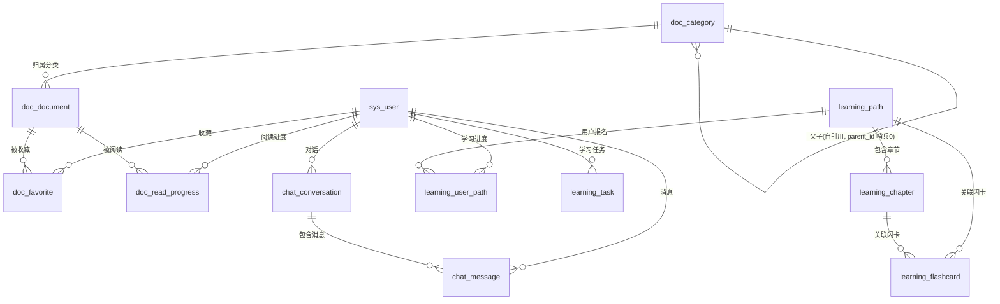

# 数据库设计文档（knowflow 知识库）

本文档说明知识库学习平台的数据库表结构、字段定义、表间关系（逻辑外键）与索引设计。
脚本位置：`backend/src/main/resources/schema.sql`（表结构 + 索引）、`data.sql`（种子数据）。

> **设计规范**：遵循《阿里巴巴 Java 开发手册》——【强制】不得使用物理外键与级联，
> 一切外键概念必须在应用层（Service）解决。本库所有表间关联均为「逻辑外键」，
> 仅存关联列 + 建普通索引，关系完整性由业务代码保证。

> 开发环境使用 H2 内存库（`jdbc:h2:mem:knowflow;MODE=MySQL`），生产可平滑切换为 MySQL（DDL 语法已兼容）。

---

## 一、实体关系（ER）总览

### 表间关系表（逻辑外键，非物理约束）

下表描述业务上的关联语义，**数据库不建立任何 FOREIGN KEY 约束**，关联列均建有普通索引以保证 JOIN/查询性能，完整性由 Service 层保证。

| 子表 | 关联列 | 逻辑引用 | 关联索引 | 可空 |
|---|---|---|---|---|
| doc_document | category_id | doc_category(id) | idx_doc_category | 是 |
| doc_favorite | user_id | sys_user(id) | idx_fav_user | 否 |
| doc_favorite | doc_id | doc_document(id) | idx_fav_doc | 否 |
| doc_read_progress | user_id | sys_user(id) | idx_rp_user | 否 |
| doc_read_progress | doc_id | doc_document(id) | idx_rp_doc | 否 |
| chat_conversation | user_id | sys_user(id) | idx_conv_user | 否 |
| chat_message | conversation_id | chat_conversation(id) | idx_msg_conv | 否 |
| chat_message | user_id | sys_user(id) | （随查询） | 否 |
| learning_chapter | path_id | learning_path(id) | idx_chap_path | 否 |
| learning_user_path | user_id | sys_user(id) | idx_up_user | 否 |
| learning_user_path | path_id | learning_path(id) | idx_up_path | 否 |
| learning_flashcard | path_id | learning_path(id) | idx_fc_path | 是 |
| learning_flashcard | chapter_id | learning_chapter(id) | idx_fc_chap | 是 |
| learning_task | user_id | sys_user(id) | idx_task_user | 否 |

> 说明：`doc_category.parent_id` 用 `0` 表示顶级分类（哨兵值）；所有逻辑删除列 `deleted` 不参与关联。以上均为逻辑外键，物理层无约束 约束。

---

## 二、数据表详细设计

### 1. sys_user（用户表）
| 字段 | 类型 | 说明 | 约束 |
|---|---|---|---|
| id | BIGINT | 主键，自增 | PK |
| username | VARCHAR(50) | 用户名 | 唯一、非空 |
| email | VARCHAR(100) | 邮箱 | |
| password | VARCHAR(255) | 密码（BCrypt 加密） | 非空 |
| nickname | VARCHAR(50) | 昵称 | |
| avatar | VARCHAR(255) | 头像 URL | |
| role | VARCHAR(20) | 角色 USER/ADMIN | 默认 USER |
| total_study_hours | DECIMAL(10,2) | 累计学习时长 | 默认 0 |
| read_docs_count | INT | 已读文档数 | 默认 0 |
| streak_days | INT | 连续打卡天数 | 默认 0 |
| favorite_count | INT | 收藏数 | 默认 0 |
| level | INT | 等级 | 默认 1 |
| exp | INT | 经验值 | 默认 0 |
| energy | INT | 能量值 | 默认 100 |
| create_time / update_time | TIMESTAMP | 创建/更新时间 | |
| deleted | INT | 逻辑删除（0/1） | 默认 0 |
- 索引：`idx_user_role(role)`、`idx_user_deleted(deleted)`

### 2. doc_document（文档表）
| 字段 | 类型 | 说明 | 约束 |
|---|---|---|---|
| id | BIGINT | 主键 | PK |
| title | VARCHAR(200) | 标题 | 非空 |
| content | TEXT | 正文 | |
| summary | VARCHAR(500) | 摘要 | |
| cover | VARCHAR(255) | 封面 | |
| category_id | BIGINT | 分类 ID | 逻辑关联 → doc_category |
| category_path | VARCHAR(500) | 分类路径 | |
| tags | VARCHAR(500) | 标签（逗号分隔） | |
| view_count | INT | 浏览数 | 默认 0 |
| read_count | INT | 阅读数 | 默认 0 |
| favorite_count | INT | 收藏数 | 默认 0 |
| word_count | INT | 字数 | 默认 0 |
| difficulty | INT | 难度（1-3） | 默认 1 |
| sort_order | INT | 排序 | 默认 0 |
| status | INT | 状态（1 已发布） | 默认 1 |
| create_time / update_time | TIMESTAMP | | |
| deleted | INT | 逻辑删除 | 默认 0 |
- 索引：`idx_doc_category(category_id)`、`idx_doc_status(status)`、`idx_doc_deleted(deleted)`、`idx_doc_ctime(create_time)`

### 3. doc_category（分类表）
| 字段 | 类型 | 说明 | 约束 |
|---|---|---|---|
| id | BIGINT | 主键 | PK |
| name | VARCHAR(50) | 名称 | 非空 |
| code | VARCHAR(50) | 编码 | |
| parent_id | BIGINT | 父分类（0=顶级） | 哨兵 0，无约束 |
| icon | VARCHAR(255) | 图标 | |
| description | VARCHAR(500) | 描述 | |
| sort_order | INT | 排序 | 默认 0 |
| doc_count | INT | 文档数 | 默认 0 |
| status | INT | 状态 | 默认 1 |
| create_time / update_time | TIMESTAMP | | |
| deleted | INT | 逻辑删除 | 默认 0 |
- 索引：`idx_cat_parent(parent_id)`、`idx_cat_status(status)`

### 4. doc_favorite（收藏表）
| 字段 | 类型 | 说明 | 约束 |
|---|---|---|---|
| id | BIGINT | 主键 | PK |
| user_id | BIGINT | 用户 | 逻辑关联 → sys_user |
| doc_id | BIGINT | 文档 | 逻辑关联 → doc_document |
| create_time / update_time | TIMESTAMP | | |
| deleted | INT | 逻辑删除 | 默认 0 |
- 索引：`idx_fav_user(user_id)`、`idx_fav_doc(doc_id)`；唯一建议 `(user_id, doc_id)`

### 5. doc_read_progress（阅读进度表）
| 字段 | 类型 | 说明 | 约束 |
|---|---|---|---|
| id | BIGINT | 主键 | PK |
| user_id | BIGINT | 用户 | 逻辑关联 → sys_user |
| doc_id | BIGINT | 文档 | 逻辑关联 → doc_document |
| progress | DECIMAL(5,2) | 进度百分比 | 默认 0 |
| read_seconds | INT | 阅读秒数 | 默认 0 |
| last_read_time | TIMESTAMP | 上次阅读时间 | |
| create_time / update_time | TIMESTAMP | | |
| deleted | INT | 逻辑删除 | 默认 0 |
- 索引：`idx_rp_user(user_id)`、`idx_rp_doc(doc_id)`

### 6. chat_conversation（对话表）
| 字段 | 类型 | 说明 | 约束 |
|---|---|---|---|
| id | BIGINT | 主键 | PK |
| user_id | BIGINT | 用户 | 逻辑关联 → sys_user |
| title | VARCHAR(200) | 标题 | |
| message_count | INT | 消息数 | 默认 0 |
| last_message | VARCHAR(500) | 最后一条消息 | |
| create_time / update_time | TIMESTAMP | | |
| deleted | INT | 逻辑删除 | 默认 0 |
- 索引：`idx_conv_user(user_id)`、`idx_conv_deleted(deleted)`

### 7. chat_message（消息表）
| 字段 | 类型 | 说明 | 约束 |
|---|---|---|---|
| id | BIGINT | 主键 | PK |
| conversation_id | BIGINT | 对话 | 逻辑关联 → chat_conversation |
| user_id | BIGINT | 用户 | 逻辑关联 → sys_user |
| role | VARCHAR(20) | user/assistant | 非空 |
| content | TEXT | 内容 | |
| doc_references | VARCHAR(1000) | 文档引用（可溯源） | |
| token_count | INT | token 数 | 默认 0 |
| create_time / update_time | TIMESTAMP | | |
| deleted | INT | 逻辑删除 | 默认 0 |
- 索引：`idx_msg_conv(conversation_id)`

### 8. learning_path（学习路径表）
| 字段 | 类型 | 说明 | 约束 |
|---|---|---|---|
| id | BIGINT | 主键 | PK |
| title | VARCHAR(200) | 标题 | 非空 |
| description | VARCHAR(1000) | 描述 | |
| cover | VARCHAR(255) | 封面 | |
| level | VARCHAR(20) | 难度等级 | |
| chapter_count | INT | 章节数 | 默认 0 |
| total_duration | INT | 总时长(分) | 默认 0 |
| enrolled_count | INT | 报名人数 | 默认 0 |
| sort_order | INT | 排序 | 默认 0 |
| status | INT | 状态 | 默认 1 |
| create_time / update_time | TIMESTAMP | | |
| deleted | INT | 逻辑删除 | 默认 0 |
- 索引：`idx_path_status(status)`

### 9. learning_chapter（章节表）
| 字段 | 类型 | 说明 | 约束 |
|---|---|---|---|
| id | BIGINT | 主键 | PK |
| path_id | BIGINT | 所属路径 | 逻辑关联 → learning_path |
| title | VARCHAR(200) | 标题 | 非空 |
| content | TEXT | 内容 | |
| sort_order | INT | 排序 | 默认 0 |
| duration | INT | 时长(分) | 默认 0 |
| doc_ids | VARCHAR(500) | 关联文档 ID | |
| flashcard_ids | VARCHAR(500) | 关联闪卡 ID | |
| create_time / update_time | TIMESTAMP | | |
| deleted | INT | 逻辑删除 | 默认 0 |
- 索引：`idx_chap_path(path_id)`

### 10. learning_user_path（用户学习路径进度表）
| 字段 | 类型 | 说明 | 约束 |
|---|---|---|---|
| id | BIGINT | 主键 | PK |
| user_id | BIGINT | 用户 | 逻辑关联 → sys_user |
| path_id | BIGINT | 路径 | 逻辑关联 → learning_path |
| progress | DECIMAL(5,2) | 进度 | 默认 0 |
| completed_chapters | INT | 已完成章节 | 默认 0 |
| enroll_time | TIMESTAMP | 报名时间 | |
| last_study_time | TIMESTAMP | 上次学习 | |
| create_time / update_time | TIMESTAMP | | |
| deleted | INT | 逻辑删除 | 默认 0 |
- 索引：`idx_up_user(user_id)`、`idx_up_path(path_id)`

### 11. learning_flashcard（闪卡表）
| 字段 | 类型 | 说明 | 约束 |
|---|---|---|---|
| id | BIGINT | 主键 | PK |
| path_id | BIGINT | 所属路径 | 逻辑关联 → learning_path（可空） |
| chapter_id | BIGINT | 所属章节 | 逻辑关联 → learning_chapter（可空） |
| front | TEXT | 正面 | |
| back | TEXT | 背面 | |
| category | VARCHAR(50) | 分类 | |
| difficulty | INT | 难度 | 默认 1 |
| review_count | INT | 复习次数 | 默认 0 |
| create_time / update_time | TIMESTAMP | | |
| deleted | INT | 逻辑删除 | 默认 0 |
- 索引：`idx_fc_path(path_id)`、`idx_fc_chap(chapter_id)`

### 12. learning_task（学习任务表）
| 字段 | 类型 | 说明 | 约束 |
|---|---|---|---|
| id | BIGINT | 主键 | PK |
| user_id | BIGINT | 用户 | 逻辑关联 → sys_user |
| title | VARCHAR(200) | 标题 | 非空 |
| description | VARCHAR(500) | 描述 | |
| type | VARCHAR(20) | 任务类型 | |
| target_id | BIGINT | 目标 ID | |
| exp_reward | INT | 经验奖励 | 默认 0 |
| energy_cost | INT | 能量消耗 | 默认 0 |
| deadline | TIMESTAMP | 截止时间 | |
| status | INT | 状态（0 待办/1 完成） | 默认 0 |
| create_time / update_time | TIMESTAMP | | |
| deleted | INT | 逻辑删除 | 默认 0 |
- 索引：`idx_task_user(user_id)`、`idx_task_status(status)`

---

## 三、索引设计原则
1. **逻辑外键列全部建索引**：不使用物理外键，但关联列（user_id、doc_id、path_id 等）必须建普通索引，保证 JOIN 与关联查询性能（如按 user_id 查收藏/进度/对话）。
2. **逻辑删除列 `deleted` 建索引**：软删除查询频繁，避免全表扫描。
3. **状态列 `status` 建索引**：列表页常按状态过滤。
4. **时间列 `create_time` 建索引**：首页/列表默认按时间倒序。
5. **分类 `parent_id` 建索引**：分类树展开查询。

## 四、设计规范（遵循《阿里巴巴 Java 开发手册》）
- **【强制】不使用物理外键与级联**：一切外键概念在应用层（Service）解决，仅存逻辑外键列 + 建索引。
- 所有表主键 `BIGINT AUTO_INCREMENT`，逻辑删除统一 `deleted INT DEFAULT 0`（表达是否删除的字段用 `deleted`/`is_xxx` 语义）。
- 时间字段统一 `TIMESTAMP DEFAULT CURRENT_TIMESTAMP`，`update_time` 由应用/触发器维护。
- 金额/进度等精确数值使用 `DECIMAL`，避免浮点误差。
- 表名、字段名全部小写下划线命名（`snake_case`），禁止大写与驼峰。
- 多对多关系（文档↔标签、章节↔文档）采用逗号分隔 `VARCHAR` 存储 ID，简化模型（适合中小规模）。
